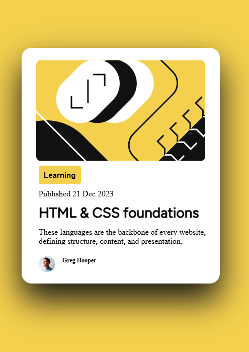
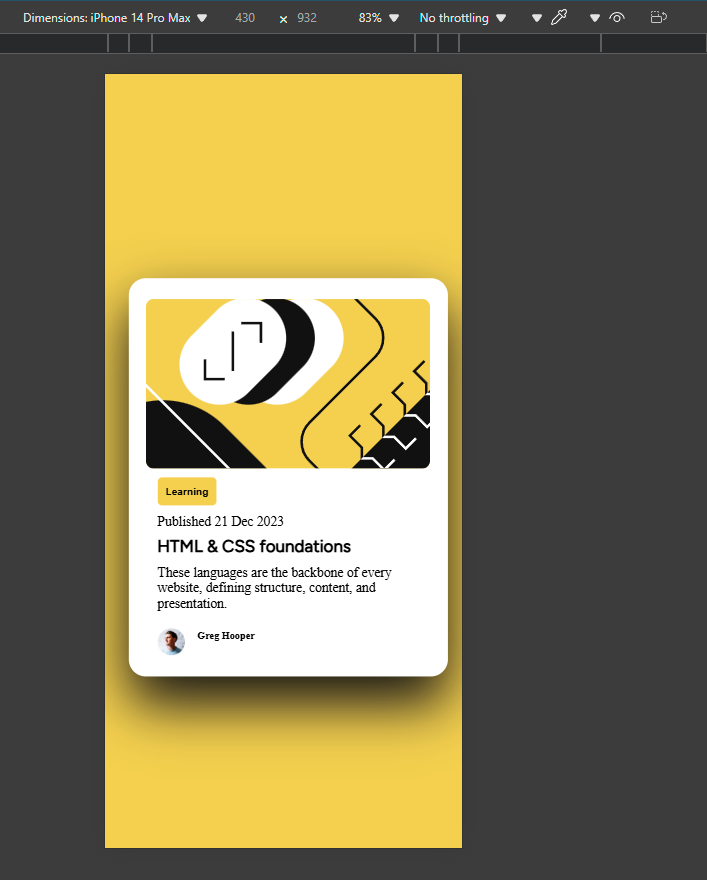

# Frontend Mentor - Blog preview card solution

This is a solution to the [Blog preview card challenge on Frontend Mentor](https://www.frontendmentor.io/challenges/blog-preview-card-ckPaj01IcS). Frontend Mentor challenges help you improve your coding skills by building realistic projects. 

## Overview
Blog preview card.

### The challenge

Users should be able to:

- See hover and focus states for all interactive elements on the page

### Screenshot



### Mobile screen shot


### Links

- Solution URL: [git hub link](https://github.com/Simonbiker/BlogPreviewCard)
- Live Site URL: [Live page](https://simonbiker.github.io/BlogPreviewCard/)

## My process

### Built with

- Semantic HTML5 markup
- CSS custom properties
- Flexbox
- Mobile-first workflow
- Adding filter instead of shadow

### What I learned

Filter is better to use than box shadow 

```
.container:hover {
    filter: drop-shadow(0 3rem 3rem #111111);
}
.container:hover > *  {
    .heading {
        color: #F4D04E;
    }
}
```


## Acknowledgments

https://youtu.be/JvuIuWbxNvU?si=w-fx58ZqXX3QcR9W

